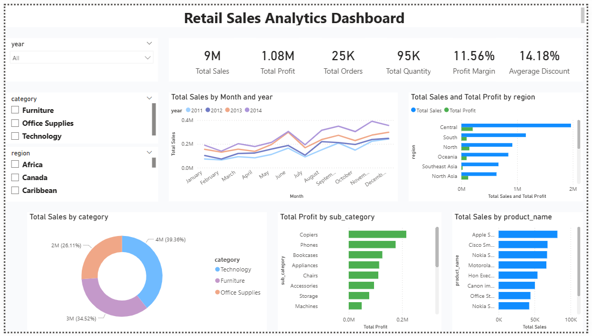
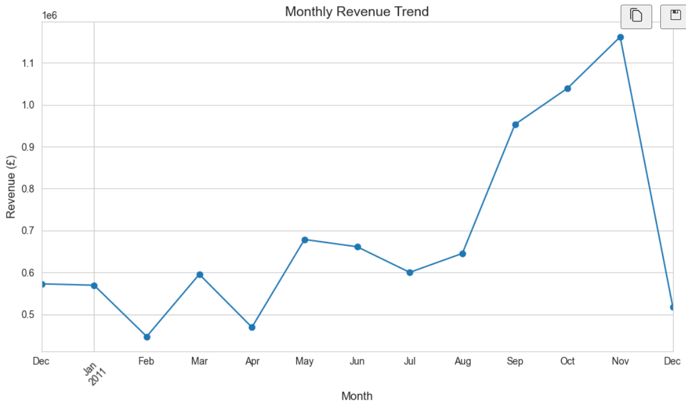
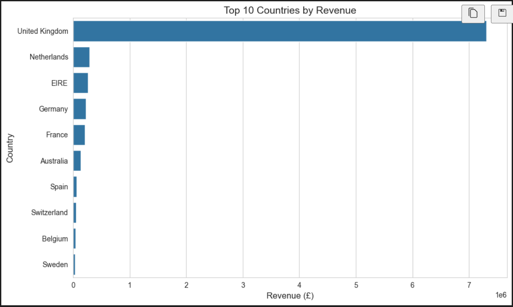

# 🌟 Data Analytics Portfolio

This repository contains **three complete data analytics projects** showcasing skills in Python, Power BI, Jupyter Notebook, and data visualization.

---

## 🛒 Projects Overview

### 1️⃣ Retail Sales Analytics Dashboard
**Folder:** `Sales Dashboard/`  
**Description:** A Power BI dashboard analyzing retail sales to track revenue, product performance, and sales trends.  

**🎯 Key Features:**
- Monthly Revenue Trend  
- Top Products Analysis  
- Revenue by Category  

**🖼️ Screenshot:**


**🛠️ Tech Stack:**
- Power BI  

---

### 2️⃣ E-commerce Sales Analysis
**Folder:** `E-commerce analysis/`  
**Description:** Python & Jupyter Notebook project analyzing e-commerce sales data for revenue trends, top products, and category insights.  

**🎯 Key Features:**
- Monthly Revenue Trend  
- Top 10 Countries by Revenue  
- Revenue by Category  

**🖼️ Key Visualizations:**




**🛠️ Tech Stack:**
- Python  
- Pandas  
- Matplotlib  
- Jupyter Notebook  

---

### 3️⃣ RFM Customer Segmentation
**Folder:** `RFM Customer Segmentation/`  
**Description:** Segment customers based on **Recency, Frequency, and Monetary** value to identify high-value customers.  

**🎯 Key Features:**
- RFM Score Calculation  
- Customer Segments Visualization  
- Targeted Customer Insights  

**🖼️ Screenshot:**


**🛠️ Tech Stack:**
- Python  
- Pandas  
- Matplotlib  
- Jupyter Notebook  

---

## 📁 Repository Structure

Data_Analytics_Portfolio/
├─ Sales Dashboard/
├─ E-commerce analysis/
├─ RFM Customer Segmentation/
├─ README.md
├─ LICENSE


---

## ✅ How to Run

1️⃣ Clone the repository:
```bash
git clone https://github.com/Ankush-Manchanda/Data_Analytics_Portfolio.git
cd Data_Analytics_Portfolio
2️⃣ For Python projects (E-commerce & RFM):

python -m venv venv
# Activate virtual environment:
# Windows
venv\Scripts\activate
# macOS/Linux
source venv/bin/activate
pip install -r requirements.txt
3️⃣ Open Jupyter Notebook (.ipynb) files and run cells to analyze the data.
4️⃣ Open Power BI dashboard (.pbix) file in Power BI Desktop to explore interactive dashboards.

🎯 Use Cases
Retail sales analytics

E-commerce sales insights

Customer segmentation for marketing strategies

Business decision-making with visual dashboards

👨‍💻 Author
Ankush M.
Project developed for personal portfolio and skill showcase.

📄 License
This project is licensed under the MIT License. See the LICENSE file for details.

---
