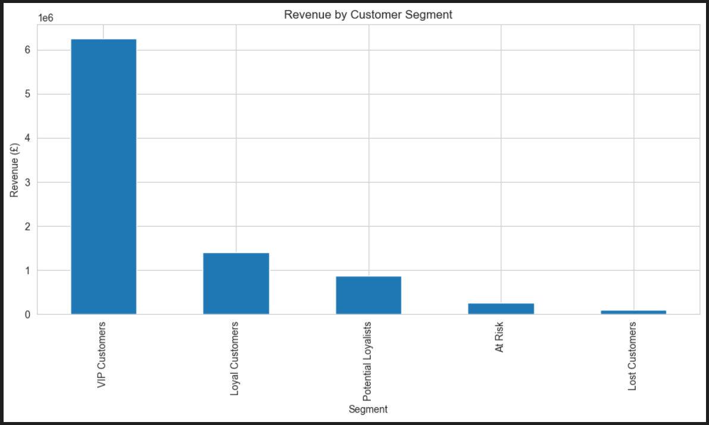

# RFM Customer Segmentation

## Project Overview
This project performs **Customer Segmentation** using **RFM (Recency, Frequency, Monetary) Analysis** in Python. It helps businesses identify top, loyal, and at-risk customers for targeted marketing.

**Key Features:**
- RFM score calculation for each customer.
- Segmentation of customers into meaningful groups.
- Visualizations of customer segments.
- Insights for personalized marketing strategies.

## Tools & Technologies
- **Python** – Analysis scripting
- **Jupyter Notebook** – Interactive analysis
- **Pandas & NumPy** – Data manipulation
- **Matplotlib & Seaborn** – Visualizations

## Dataset
- E-commerce customer purchase data with Customer ID, Invoice Date, and Amount.
- Columns include: CustomerID, InvoiceDate, InvoiceNo, Amount.

## Key Insights
- Identified high-value customers for loyalty programs.
- Segmented customers to design targeted campaigns.
- Visualized recency, frequency, and monetary distribution.

## Screenshots

## How to Run
1. Open the `RFM_Customer_Segmentation.ipynb` notebook in Jupyter.
2. Ensure the dataset CSV is in the same folder.
3. Run all cells to generate RFM scores, segmentation, and visualizations.

## Outcome / Freelancing Value
- Helps businesses optimize marketing campaigns.
- Provides actionable insights for increasing customer retention and sales.
